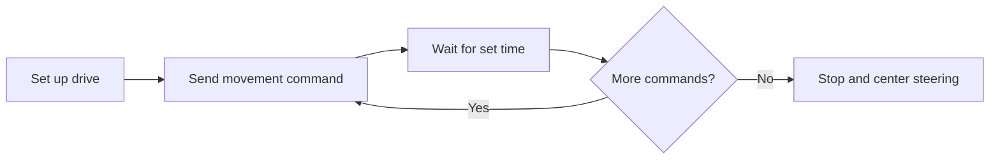

# Learning to Control a Robot

**Program:** Zebra Robotics Self-Driving Vehicle engineering  
**Status:** Early motion-control code and a chassis model available here

## What I worked on

The SDV program explores how a robot can move around a 10 × 10 foot challenge mat. It includes programming, Time-of-Flight sensors, cameras, CAD, and 3D printing. I also took part in the RTP SDV League “Ride Rush” competition in June 2026.

I worked on the robot's chassis and learned how a CAD model becomes a printed part. The program used Onshape and a Bambu Lab printer. I have added a [chassis model note](../artifacts/robotics/SDV_Chassis.md); the binary STL remains in the private working repository while I check the public-sharing details.

## What the code here does

The [Python file](../artifacts/robotics/user_main.py) sets up the motor and steering ports, drives through a fixed sequence, and stops. It uses timed waits between commands. It does not read a camera or distance sensor, detect obstacles, or choose a path.

This code is based on a Zebra Robotics Ackermann-drive example and uses its hardware library. I did not write the starter framework from scratch. [My code notes](../artifacts/robotics/code-notes.md) explain how I read the sequence and what still needs testing.

## What I learned

The program helped me connect software commands with a physical robot. The chassis and sensor positions matter too. My engineering journal notes that changing sensor placement affected readings, but I do not have the sensor code or measured comparison to share here yet.

## What I want to do next

I want to compare the timed approach with movement that uses sensor readings. I also want to record the same test several times so I can see how consistently the robot behaves.

[Back to my portfolio](../README.md)
